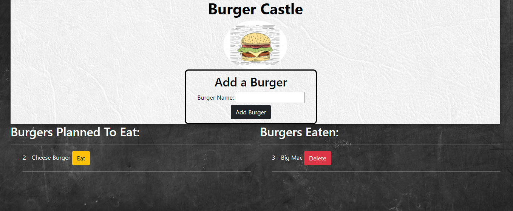

# Burger App  
# with Node Express Handlebars
  
  

  [Link to webpage](https://hidden-dawn-48775.herokuapp.com/)
  
  Logs burgers that the users wants to eat, and can update the burger when the user has eaten the burger, and later delete it.   
    
  ## Table of Content
  [-Installation](#Installation)  
  [-Description](#Description)    
  [-Usage](#Usage)  
  [-Questions](#Questions)  
  
  
  ## Installation  
  The user needs MySQL and Node.js. The user needs to update their users information in config/connection. The user needs to "npm i" to install express, express handlebars and MySQL modules. Then the user can write "node server.js" in the terminal to run the project.

  ## Description  
  This project uses MySQL as a database to log all the information about the burgers. The express handlebars is used to create the website, where all the burger information is added through the index.handlebars and rendered into the site. The ORM files in config and models are used to treat the MySQL request and burger controller manages the api routes. 

  Inside the db folder you fill find the database for use for local server and a seed with some starter inserts in it

  ## Usage  
  This project is used to plan the users burger consumption, making a burger bucket list and then can mark of the burgers when digested.
  
  
  ## Questions?  
  
    My Github link is [NVrtis](https://github.com/NVrtis)
    Any futher questions can be sent to my email here  <Nvav91@gmail.com>

  
 
  
  